# Future Home

Welcome to Future Home, the website that will allow you to browse and find your dream house!

Site viewers can access the home page, in order to get an idea of the content of the website. They are able to easily gaze at the list of listings and view the details of each listing. if they wish to like listings, ask questions or book viewings, they can also sign up to the site through the registration form. 
Lastly, they can connect through the social media located in the footer.

Registered Site Users can like/unlike listing, ask questions related to the individual listing and book viewings. 

Questions and booking need to be approved by the Site Admin. 
The admin can also create, update and delete listing, directly from the webpage.

View the live project here: [Future Home](https://future-home.herokuapp.com/)

## Index – Table of Contents
* [User Experience (UX)](#user-experience-ux)
  * [User Stories](#user-stories)
* [Features](#features)
* [Technologies Used](#technologies-used)
* [Testing](#testing)
* [Deployment](#deployment)
* [Credits](#credits)

## User Experience (UX)

### User stories :

* US01: View site.
    - As a Site User I can access the Home page so that I can understand the site purpose and decide if relevant to my needs.
* US02: Pagination.
    - As a Site User I can view a paginated lists of posts so that I can select a post to view.
* US03: View a list of posts.
    - As a Site User I can view a lists of posts so that I can select a post to view.
* US04: Open a post.
    - As a Site User I can click on a post so that I can read the details of the post.
* US05: Account registration.
    - As a Site User I can register an account so that I can book a viewing.
* US06: Like/unlike
    - As a Site User I can like or unlike listings so that I can trace my favourite listings.
* US07: Manage posts:
    - As a Site Admin I can create, read, update and delete posts so that I can manage my listings.
* US08: Confirm bookings.
    - As a Site Admin I can approve or disapprove bookings so that I can manage time slot efficiently.
* US09: Approve questions.
    - As a Site Admin I can approve questions so that I can review its content before it is posted.
* US10: Ask questions.
    - As a Site User I can submit a question to the estate agent so that receive the information I need.
* US11: View questions.
    - As a Site Admin I can view questions from Site Users so that I can approve them and publish them.
* US12: Reply to questions.
    - As a Site Admin I can reply to questions so that I can build trust with the Site User and answer their queries.

## Features

### Existing Features

- __Favicon__

  - A Favicon has been implemented using the image on the logo and main image of the website.
  - It will be easier for the User to identify the website if they have more than one tab open.
  - 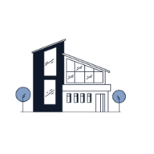

- __Navigation Bar__

  - The Navigation bar will appear slightly different, depending on the status of the User.   
      - If the Site User is not Logged in, it includes links to the Home page, the Sign In and Sign Up forms.
      
      - If the Site User is logged in, it includes links to the Home page and the Logout form.
      
      - If the Site User is a Superuser, there is also a link to add listings.
      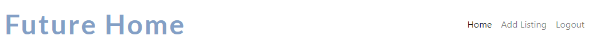
   - Featured on all pages, the navigation bar is fully responsive.
   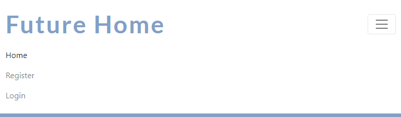
   - This section will allow the user to easily navigate and sign In/Up to make use of the full website functionality, without having to revert back to the previous page. 

- __The landing page image__

  - The landing page includes a logo and a brand name, to allow the user to understand exactly what kind of contents they can expect. 
  - This section introduces the user to Future Home with an eye catching animation to grab their attention.

    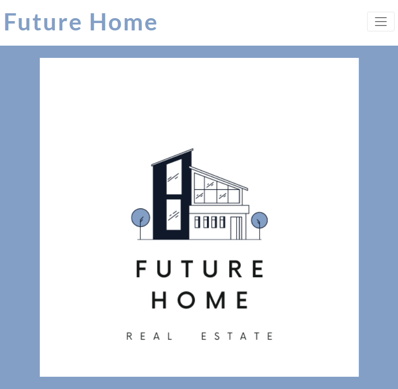

- __The listings list__

  - The listings list is paginated and includes a picture and the address, to allow the user to localise the house without having to read the full details. 
  - This section shows when the house was put up for sale, and how many people liked it.

    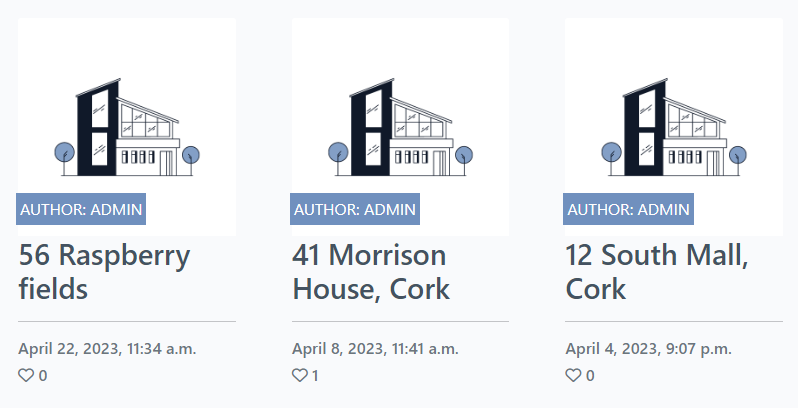

- __The listings details__

  - The listings details page includes the picture and the address, ana a series of relevant information, like number of bedrooms/bathrooms, or price.
    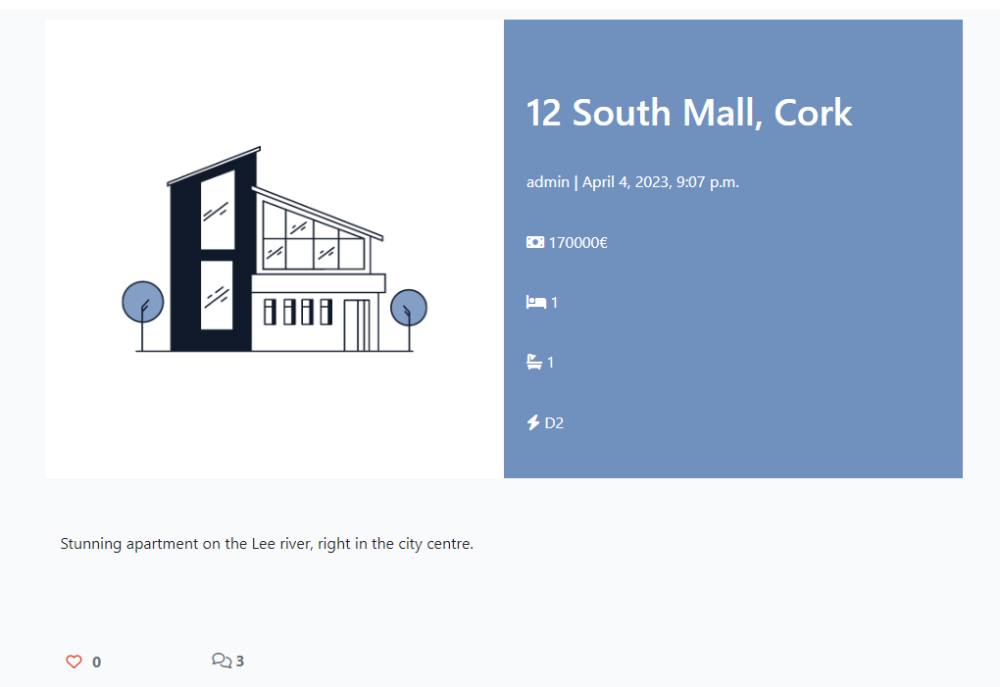
  - Below, there is a list of questions that have been asked by registered Site User.
    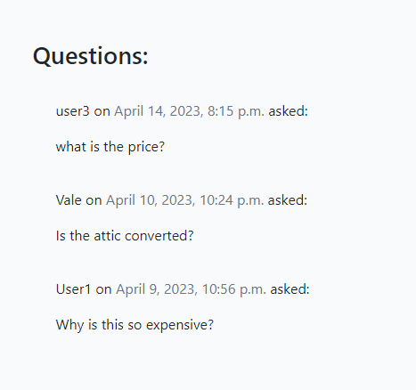
  - If the Site User is not registered, there is a prompt to sign in/up, in order to like/unlike the listing, or ask questions.
    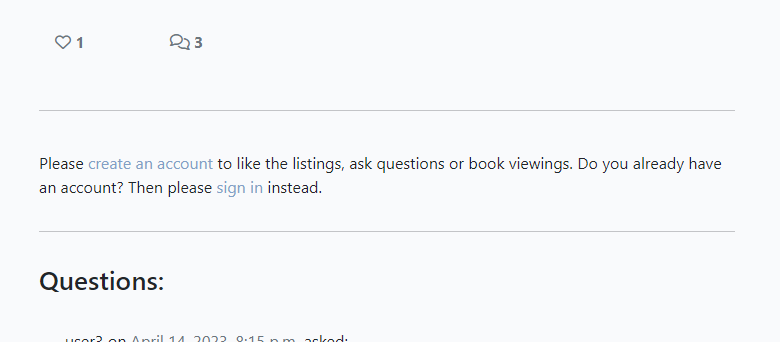
  - If the Site User is registered, they will be able to ask questions through a form.
    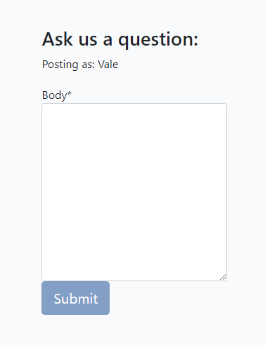 
  - At the bottom of the page, there is a button that allows to go back to the home page.
    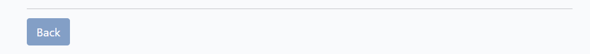
    

- __The Admin functionalities__

  - The Admin will be able to add, edit and delete listings directly through the webpage, without the need of accessing the admin site.
  - The Admin's navigation bar contains a link to add a new listing.
  
  - Once clicked on "Add Listing", the Site Admin has a form that contains all relevant information.
  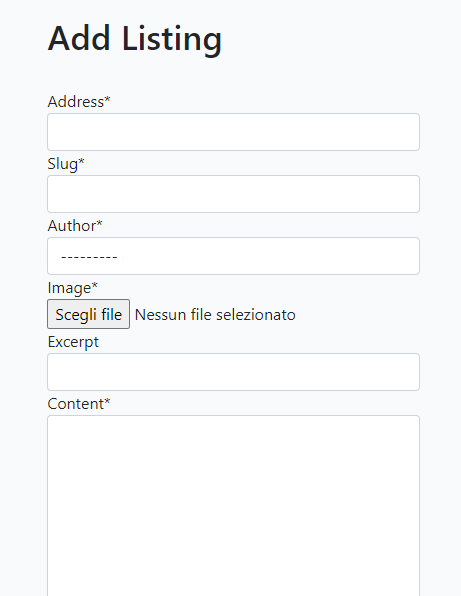
  - In the listing detail page, the Site Admin has also the opportunity to edit o delete a listing.
  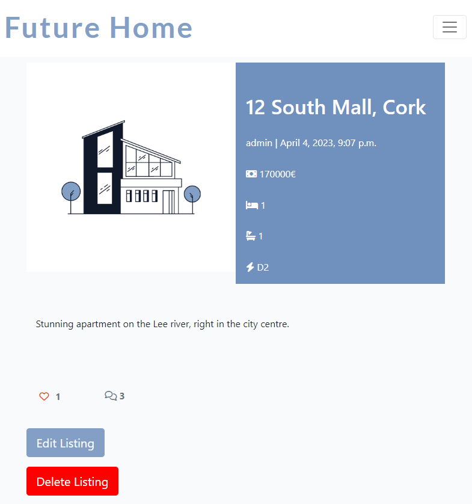
  - The Edit form is quite simple and inludes just change in content, price and status.
  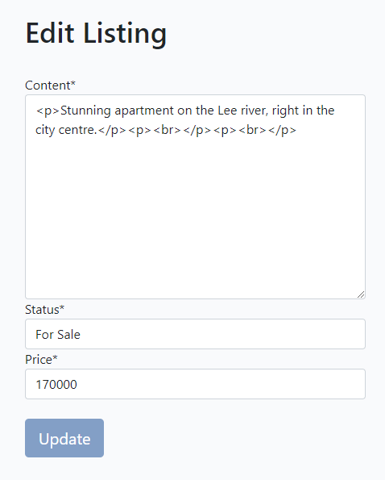
  - The Delete form just confirms the intention to delete the listing.
  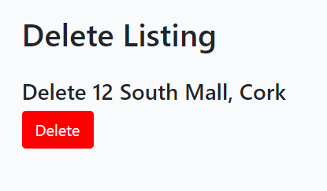

- __The Footer__ 

  - The footer section includes links to the relevant social media sites for Future Home. The links will open to a new tab to allow easy navigation for the Site User. 
  - The footer is valuable to the user as it encourages them to keep connected via social media.

    

- __Sign In/Register Form__

  - The "Sign In" will provide the user with the opportunity to register to the website.
  - In case the Site User is already registered, it provides the option to Sign Up instead. 
  - This section is valuable to the user as they will be able to access the full website functionality.
  - The form collects the User username, an email address, and a password, that needs to be confirmed for registration purpouse. 

    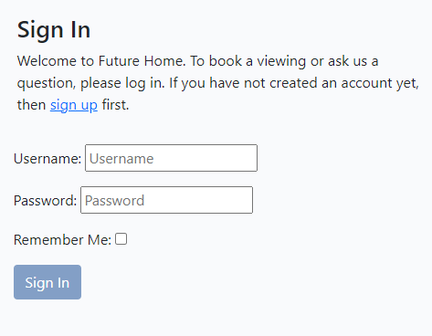

- __Sign Up Form__

  - The "Sign Un" will provide the user with the opportunity to sign up to the website.
  - In case the Site User is not already registered, it provides the option to Register instead. 
  - This section is valuable to the user as they will be able to access the full website functionality.
  - The form collects the username and password only. 

    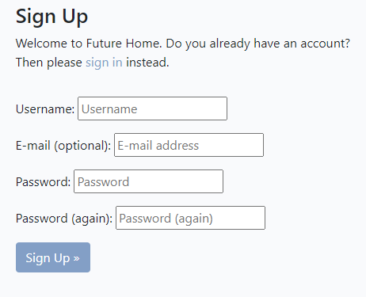

- __Logout Form__

  - This page will allow the Site User to log out.
  - After clicking the button, a second page will ask to confirm the intention to log out. 

    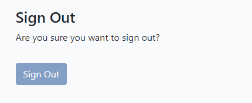

### Features Left to Implement

- Add photo gallery, perhaps with a carousel, when there will be enough content for it to be implemented.
- Add Maps to show the location of the houses advertised.
- Add proper booking system for house viewings.
- Add reply sistem for Site User's questions.
- Add profile page for Site Users, so they can check the upcoming viewings and the replies to their questions.

## Technologies Used

### Languages
* [HTML5](https://en.wikipedia.org/wiki/HTML) - Provides the content and structure for the website.
* [CSS3](https://en.wikipedia.org/wiki/CSS) - Provides the styling for the website.
* [Python](https://en.wikipedia.org/wiki/Python_(programming_language)) - Provides the functionality for the site.

### Frameworks & Software
* [Github](https://github.com/) 
* [Bootstrap](https://getbootstrap.com/) 
* [Django](https://www.djangoproject.com/) 
* [Gitpod](https://www.gitpod.io/)
* [Balsamiq](https://balsamiq.com/)
* [Heroku](https://en.wikipedia.org/wiki/Heroku) 
* [AmIresponsive](https://ui.dev/amiresponsive) 
* [Favicon](https://favicon.io/) 
* [Google Chrome DevTools](https://developer.chrome.com/docs/devtools/) 
* [Cloudinary](https://cloudinary.com/) 
* [Canva](https://www.canva.com/colors/color-wheel/ ) 
* [HTML Validation](https://validator.w3.org/) 
* [CSS Validation](https://jigsaw.w3.org/css-validator/)
* [Lighthouse](https://developer.chrome.com/docs/lighthouse/overview/)

## Testing 

- I tested this page in different browsers: Chrome, Edge, Safari.
- The project is responsive, and it looks and works well on different browsers and screen sizes.
  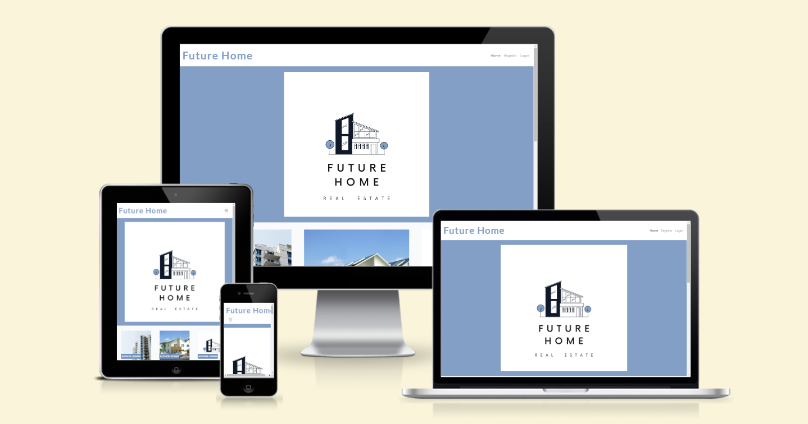

### Validator Testing 

- HTML
  - No errors were returned when passing through the official W3C validator:
    - [Home Page]()
    - [Activities Page]()
    - [Contact Us Page]()

- CSS
  - No errors were found when passing through the official [(Jigsaw) validator]()
    - [Home Page](http://jigsaw.w3.org/css-validator/validator?lang=it&profile=css3svg&uri=https%3A%2F%2Ffuture-home.herokuapp.com%2F&usermedium=all&vextwarning=&warning=1)
    - 
    - [Contact Us Page]()

- Python
  - I used , and one error was returned on the settings.py file:
    - Line 128 is too long (87 characters over 79 allowed), but unfortunately it is not possible to modify it.
    [Settings.py](./static/images/Settings.py.png)

  - The remaining Python files did not show any errors:
    - [Asgi.py](./static/images/asgy_py.png)
    - [Urls.py](./static/images/urls_py.png)
    - [Wsgi.py](./static/images/wsgi_py.png)
    - [Admin.py](./static/images/admin_py.png)
    - [Apps.py](./static/images/apps_py.png)
    - [Forms.py](./static/images/forms_py.png)
    - [Models.py](./static/images/models_py.png)
    - [Tests.py](./static/images/tests_py.png)
    - [Urls.py](./static/images/urls_app_py.png)
    - [Views.py](./static/images/views_py.png)

- Accessibility
  - Performance, accessibility and best practices were assessed through Lighthouse in devtools and passed the testing with good scores.
    

### Fixed Bugs

- Removed migrations made during design, using "python3 manage.py migrate futurehomeapp 0017", as 0017 included features that were removed before final deployment.
- Pictures did not show on the deployed website, so the relevant links were reviewed and Cloudinary was checked to make sure that the static files were copied.

### Unfixed Bugs
None

## Deployment

  The live link can be found here - [Future Home]()

## Credits  

### Content 

- The main structure and the README file are inspired to the I Think Therefore I Blog project.
- The main image and logo were developed and designed using [Canva](https://www.canva.com/).
- The icons were taken from [Font Awesome](https://fontawesome.com/)
- The [favicon](./static/images/favicon.png) was created uploading the main image onto [Favicon.io](https://favicon.io/favicon-generator/).
- The [mockup] was simulated using [AmIResponsive](https://ui.dev/amiresponsive)
- The colours for the form were selected through [Coolors](https://coolors.co/) 
- [W3 School](https://www.w3schools.com/) e [StackOverflow.com](https://stackoverflow.com/) were consulted regularly for tips on general coding.
- I read this article to help implementing a booking system [Django Tutorial](https://blog.devgenius.io/django-tutorial-on-how-to-create-a-booking-system-for-a-health-clinic-9b1920fc2b78)
- I read [Better Programming](https://betterprogramming.pub/build-a-personal-journal-with-django-and-python-f4835d27368c) article, to have an overview on blogs and functionality.
- I watched [Code with Stein](https://www.youtube.com/watch?v=I8TRkEcw9Mg) tutorials.
- I searched for other PP4 projects on GitHub, to make sure I was working in the right direction.

### Disclaimer

The information provided on this site is intended for educational purposes only.

