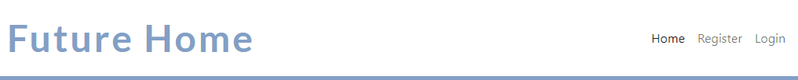
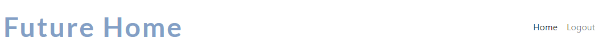

# Future Home

Welcome to Future Home, the website that will allow you to browse and find your dream house!

Site viewers can access the home page, in order to get an idea of the content of the website. They are able to easily gaze at the list of listings and view the details of each listing. if they wish to like listings, ask questions or book viewings, they can also sign up to the site through the registration form. 
Lastly, they can connect through the social media located in the footer.

Registered Site Users can like/unlike listing, ask questions related to the individual listing and book viewings. 

Questions and booking need to be approved by the Site Admin. 
The admin can also create, update and delete listing, directly from the webpage.

View the live project here: [Future Home](https://future-home.herokuapp.com/)

## Index – Table of Contents
* [User Experience (UX)](#user-experience-ux)
  * [User Stories](#user-stories)
* [Features](#features)
  * [Existing Features](#existing-features) 
  * [Features Left to Implement](#features-left-to-implement)
* [Technologies Used](#technologies-used)
  * [Languages](#languages)
  * [Frameworks & Software](#frameworks-software)
* [Testing](#testing)
  * [Validator Testing](#validator-testing)
  * [Manual Testing](#manual-testing)
  * [Fixed Bugs](#fixed-bugs)
  * [Unfixed Bugs](#unfixed-bugs)
* [Deployment](#deployment)
  * [Creating the Project](#creating-project)
  * [Deployment to Heroku](#deployment-heroku)
  * [Final Deployment](#final-deployment)
  * [Forking the Repository](#forking-the-repository)
  * [Cloning the Repository](#cloning-the-repository)
* [Credits](#credits)
  * [Contents](#contents)
  * [Disclaimer](#disclaimer)

## User Experience (UX)

### User stories :

* US01: View site.
    - As a Site User I can access the Home page so that I can understand the site purpose and decide if relevant to my needs.
* US02: Pagination.
    - As a Site User I can view a paginated lists of posts so that I can select a post to view.
* US03: View a list of posts.
    - As a Site User I can view a lists of posts so that I can select a post to view.
* US04: Open a post.
    - As a Site User I can click on a post so that I can read the details of the post.
* US05: Account registration.
    - As a Site User I can register an account so that I can book a viewing.
* US06: Like/unlike
    - As a Site User I can like or unlike listings so that I can trace my favourite listings.
* US07: Manage posts:
    - As a Site Admin I can create, read, update and delete posts so that I can manage my listings.
* US08: Confirm bookings.
    - As a Site Admin I can approve or disapprove bookings so that I can manage time slot efficiently. - Not implemented
* US09: Approve questions.
    - As a Site Admin I can approve questions so that I can review its content before it is posted.
* US10: Ask questions.
    - As a Site User I can submit a question to the estate agent so that receive the information I need.
* US11: View questions.
    - As a Site Admin I can view questions from Site Users so that I can approve them and publish them.
* US12: Reply to questions.
    - As a Site Admin I can reply to questions so that I can build trust with the Site User and answer their queries.

## Features

### Existing Features

- __Favicon__

  - A Favicon has been implemented using the image on the logo and main image of the website.
  - It will be easier for the User to identify the website if they have more than one tab open.
  - 

- __Navigation Bar__

  - The Navigation bar will appear slightly different, depending on the status of the User.   
      - If the Site User is not Logged in, it includes links to the Home page, the Sign In and Sign Up forms.
      
      - If the Site User is logged in, it includes links to the Home page and the Logout form.
      
      - If the Site User is a Superuser, there is also a link to add listings.
      
   - Featured on all pages, the navigation bar is fully responsive.
   
   - This section will allow the user to easily navigate and sign In/Up to make use of the full website functionality, without having to revert back to the previous page. 

- __The landing page image__

  - The landing page includes a logo and a brand name, to allow the user to understand exactly what kind of contents they can expect. 
  - This section introduces the user to Future Home with an eye catching animation to grab their attention.

    

- __The listings list__

  - The listings list is paginated and includes a picture and the address, to allow the user to localise the house without having to read the full details. 
  - This section shows when the house was put up for sale, and how many people liked it.

    

- __The listings details__

  - The listings details page includes the picture and the address, ana a series of relevant information, like number of bedrooms/bathrooms, or price.
    
  - Below, there is a list of questions that have been asked by registered Site User.
    
  - If the Site User is not registered, there is a prompt to sign in/up, in order to like/unlike the listing, or ask questions.
    
  - If the Site User is registered, they will be able to ask questions through a form.
     
  - At the bottom of the page, there is a button that allows to go back to the home page.
    
    

- __The Admin functionalities__

  - The Admin will be able to add, edit and delete listings directly through the webpage, without the need of accessing the admin site.
  - The Admin's navigation bar contains a link to add a new listing.
  
  - Once clicked on "Add Listing", the Site Admin has a form that contains all relevant information.
  
  - In the listing detail page, the Site Admin has also the opportunity to edit o delete a listing.
  
  - The Edit form is quite simple and inludes just change in content, price and status.
  
  - The Delete form just confirms the intention to delete the listing.
  

- __The Footer__ 

  - The footer section includes links to the relevant social media sites for Future Home. The links will open to a new tab to allow easy navigation for the Site User. 
  - The footer is valuable to the user as it encourages them to keep connected via social media.

    

- __Sign In/Register Form__

  - The "Sign In" will provide the user with the opportunity to register to the website.
  - In case the Site User is already registered, it provides the option to Sign Up instead. 
  - This section is valuable to the user as they will be able to access the full website functionality.
  - The form collects the User username, an email address, and a password, that needs to be confirmed for registration purpouse. 

    

- __Sign Up Form__

  - The "Sign Up" will provide the user with the opportunity to sign up to the website.
  - In case the Site User is not already registered, it provides the option to Register instead. 
  - This section is valuable to the user as they will be able to access the full website functionality.
  - The form collects the username and password only. 

    

- __Logout Form__

  - This page will allow the Site User to log out.
  - After clicking the button, a second page will ask to confirm the intention to log out. 

    

### Features Left to Implement

- Add photo gallery, perhaps with a carousel, when there will be enough content for it to be implemented.
- Add Maps to show the location of the houses advertised.
- Add proper booking system for house viewings.
- Add reply sistem for Site User's questions, directly through the main page, without having to access the Admin panel.
- Add profile page for Site Users, so they can check the upcoming viewings and the replies to their questions.

## Technologies Used

### Languages
* [HTML5](https://en.wikipedia.org/wiki/HTML) - Provides the content and structure for the website.
* [CSS3](https://en.wikipedia.org/wiki/CSS) - Provides the styling for the website.
* [Python](https://en.wikipedia.org/wiki/Python_(programming_language)) - Provides the functionality for the site.

### Frameworks & Software
* [Github](https://github.com/) 
* [Bootstrap](https://getbootstrap.com/) 
* [Django](https://www.djangoproject.com/) 
* [Gitpod](https://www.gitpod.io/)
* [Balsamiq](https://balsamiq.com/)
* [Heroku](https://en.wikipedia.org/wiki/Heroku) 
* [AmIresponsive](https://ui.dev/amiresponsive) 
* [Favicon](https://favicon.io/) 
* [Google Chrome DevTools](https://developer.chrome.com/docs/devtools/) 
* [Cloudinary](https://cloudinary.com/) 
* [Canva](https://www.canva.com/colors/color-wheel/ ) 
* [HTML Validation](https://validator.w3.org/) 
* [CSS Validation](https://jigsaw.w3.org/css-validator/)
* [Lighthouse](https://developer.chrome.com/docs/lighthouse/overview/)

## Testing 

- I tested this page in different browsers: Chrome, Edge, Safari.
- The project is responsive, and it looks and works well on different browsers and screen sizes.
  

### Validator Testing 
- HTML
  - No errors were returned when passing through the official W3C validator:
    - [Home Page](./static/images/html_test.png)

- CSS
  - No errors were found when passing through the official [(Jigsaw) validator]()
    - [Home Page](http://jigsaw.w3.org/css-validator/validator?lang=it&profile=css3svg&uri=https%3A%2F%2Ffuture-home.herokuapp.com%2F&usermedium=all&vextwarning=&warning=1)

- Python
  - I used [Python linter](https://pep8ci.herokuapp.com/), and one error was returned on the settings.py file:
    - Line 128 is too long (87 characters over 79 allowed), but unfortunately it is not possible to modify it.
    [Settings.py](./static/images/Settings.py.png)

  - The remaining Python files did not show any errors:
    - [Asgi.py](./static/images/asgy_py.png)
    - [Urls.py](./static/images/urls_py.png)
    - [Wsgi.py](./static/images/wsgi_py.png)
    - [Admin.py](./static/images/admin_py.png)
    - [Apps.py](./static/images/apps_py.png)
    - [Forms.py](./static/images/forms_py.png)
    - [Models.py](./static/images/models_py.png)
    - [Tests.py](./static/images/tests_py.png)
    - [Urls.py](./static/images/urls_app_py.png)
    - [Views.py](./static/images/views_py.png)

- Accessibility
  - Performance, accessibility and best practices were assessed through Lighthouse in devtools and passed the testing with good scores.
    
  - The Performance score might be improved converting the .png files in .webp files, in order to compress the images and facilitate the upload when the page is loaded. For lack of time, I did not convert them, but it is certainly an improvement that can be made.

### Manual Testing

- Navigation Bar:
  - The "Future Home" logo redirects to the home page when clicked.
  - The  "Home" button on the navigation bar redirects to the Home page when clicked.
  - The "Register" button on the navigation bar changes colour when hovered on and loads the "Sign Up" page when clicked.
  - The "Sign Up" page has been tested and works well.
  - The "Login" button on the navigation bar changes colour when hovered on and loads the "Sign In" page when clicked.
  - The "Sign In" page has been tested and works well.
  - When signing in, a green pop-up message confirms that we are now logged in with our username.
  - The Navigation bar is fully responsive and it was tested on larger screens where the features are listed on the top right of the page, and on smaller screens, where it looks compressed in a menu icon, that opens up below to show the pull list of features.
- Home Page:
  - Every time that the home page is loaded, the main image containing the logo and the brand name feature a zooming animation, obtained through CSS.
  - Clicking on any of the listing titles will open that listing, showing the main details relative to that listing.
  - The pagination of the listings has been set to 3 per row on larger screens, and only one on smaller screens. The pagination is fully responsive, and was tested on large and small screens.
- Opening a listing:
  - If the user is not logged in, it is only possible to view the listing details, the number of likes and comments, and the questions asked and answered.
  - It is possible to create an account clicking on the relevant text, that changes colour and becomes highlighted when hovered on. The feature works and opens the Sign Up page.
  - It is also possible to sign in if the user is already registered. The text for signing in changes colour and becomes highlighted when hovered on. The feature works and opens the Sign In page.
- Footer:
  - When clicked, the "Facebook" icon opens a new tab and redirects to www.facebook.com.
  - When clicked, the "Twitter" icon opens a new tab and redirects to www.twitter.com.
  - When clicked, the "YouTube" icon opens a new tab and redirects to www.youtube.com.
  - When clicked, the "Instagram" icon opens a new tab and redirects to www.instagram.com.
- When signing in as a regular user:
  - When signing in, a green pop-up message confirms that we are now logged in as our username.
  - The Navigation bar changes to "Home" and "Logout".
  - Selecting "Home", it redirects to the Home page.
  - Selecting "Logout", redirects to a Sign Out page where the confirmation to sign out is required in order to successfully do so. This feature has been tested and works well.
  - When signing out, a green pop-up message confirms that we are now logged out.
  - Selecting one of the listing to the homepage, will open that listing.
  - As a logged in user, it is possible to like/dislike a listing, and the feature has been tested and works well.
  - As a logged in user, it is possible to ask a question on the specific listing, and the feature has been tested and works well. The question needs to be approved by the Admin before being shown among the lists of questions.
- When signing in as an Admin:
  - When signing in, a green pop-up message confirms that we are now logged in as Admin.
  - The Navigation bar changes to "Home", "Add listing" and "Logout".
  - Selecting "Home", it redirects to the Home page.
  - Selecting "Add Listing", opens a new page with a list of listing details that need to be filled in order to add a new listing. Clicking the "Add" button at the end of the page will add a new listing. The same outcome can be achieved accessing the [Admin Page](https://future-home.herokuapp.com/admin/) once logged in as an Admin. Selecting "Listing" on the "Futurehomeapp", it is possible to just click on the + Add button and insert the same information.
  Having the "Add listing" on the navigation bar saves time to the Admin in adding new listings.
  - Selecting "Logout", redirects to a Sign Out page where the confirmation to sign out is required in order to successfully do so. This feature has been tested and works well.
  - When signing out, a green pop-up message confirms that we are now logged out.
  - Selecting one of the listing to the homepage, will open that listing.
  - As an Admin, it is possible to like/dislike a listing, and the feature has been tested and works well.
  - As an Admin, it is possible to edit the listing. Clicking on the blue "Edit Listing" button (that changes colour when hovered on) opens a new page with content, status and price of the listing. These information can be amended accordingly by the Admin. Clicking "Update" allows the Admin to edit without accessing the Admin panel. The feature has been tested and works well.
  - As an Admin, it is also possible to delete the listing. Clicking on the red "Delete Listing" button (that changes colour when hovered on) opens a new page requesting the confirmation to delete that listing. Clicking "Delete" allows the Admin to delete the listing without accessing the Admin panel. The feature has been tested and works well.
  - As an Admin, it is possible to add a question or a comment on the specific listing, and the feature has been tested and works well.
- Security:
  - If a user attempts to log into the admin panel from the URL, they are redirected to a login screen that requires credentials in order to access restricted features of the website.
  - All Admin-only features have been tested and do not appear as editable for other users (both logged in or non-logged in).

### Fixed Bugs
- Removed migrations made during design, using "python3 manage.py migrate futurehomeapp 0017", as 0017 included features that were removed before final deployment.
- Pictures did not show on the deployed website, so the relevant links were reviewed and Cloudinary was checked to make sure that the static files were copied.

### Unfixed Bugs
- Line 128 too long in Settings.py file.
- Pictures can be compressed in order to get a better performance score on Lighthouse.

## Deployment

### Creating the Project
1. Create a new GitHub repository from the [Code Institute template](https://github.com/Code-Institute-Org/gitpod-full-template), clicking on "Use this template" and then "Create repository from template".
2. Once the repository has been created, open it in the GitPod workspace by clicking on the GitPod button.
3. Install Django and the relevant libraries:
  - `pip3 install 'django<4' gunicorn`
  - `pip3 install dj_database_url==0.5.0 psycopg2`
  - `pip3 install 'dj3-cloudinary-storage`
4. Create a requirements.txt file:
  - `pip3 freeze --local > requirements.txt`
5. Create a new project typing: 
  - `django-admin startproject PROJECT_NAME .`
  - This command creates a manage.py file and a new directory called PROJECT_NAME.
6. Create the application typing:
  - `python3 manage.py startapp APPLICATION_NAME`
7. Add the application to the list of installed apps in the settings.py file. 
  - Open the PROJECT_NAME directory, navigate to the settings.py file and add the APPLICATION_NAME to the list of the INSTALLED_APPS.
8. Migrate the changes to the database:
  - `python3 manage.py migrate`
9. Run the server:
  - `python3 manage.py runserver`
  - This command will open the project in the browser.

### Deployment to Heroku
1. Create an account or log in to [Heroku](https://www.heroku.com/).
2. On the dashboard, click on "New" and select "Create new app".
3. Give the app a unique name and select the region closest to you. Then click "Create app" to confirm.
4. To create a new database that can be accessed by Heroku, create an account or log in to [ElephantSQL](https://customer.elephantsql.com/login).
5. Click "Create New Instance".
6. Set up your plan, giving it a name and choosing the "Tiny Turtle (free)" plan.
7. Select the Region and data center closer to you, and then click "Review" and confirm clicking on "Create instance".
8. Return to the ElephantSQL dashboard and click on the database instance name for this project.
 - In the URL section, click the copy icon to copy the database URL.
9. In the project workspace, create a file called env.py and include it in the .gitignore file. 
10. In the env.py file:
  - `import os`
  - `os.environ["DATABASE_URL"] = "copiedURL"`
  - `os.environ["SECRET_KEY"] = "secretKEY"`
11. Open up your settings.py file and add the following code below your Path import
 `import os`
 `import dj_database_url`
 `if os.path.isfile('env.py'):`
    `import env`
12. Remove the insecure secret key provided by Django. Instead, we will reference the variable in the env.py file, so change your SECRET_KEY variable to the following
  `SECRET_KEY = os.environ.get('SECRET_KEY')`
13. Comment out the original DATABASES variable and add the code below: 
  `DATABASES = {`
     `'default': dj_database_url.parse(os.environ.get("DATABASE_URL"))`
  `}`
14. Run the migration command in your terminal to migrate your database structure to the newly-connected ElephantSQL database:
- `python manage.py migrate`
15. In the Heroku app settings, click on the 'Reveal Config Vars' button. Create a config variable called DATABASE_URL and paste in the URL you copied from ElephantSQL. This connects the database into the app.
16. Click Reveal Config Vars and add a new record with SECRET_KEY.
17. Set up a Cloudinary account on [Cloudinary](https://cloudinary.com/)
18. Copy to clipboard the API Environment Variable.
19. Add another line to the env.py file:
- `os.environ["CLOUDINARY_URL"] = "cloudinary://***"`
20. Add a new config variable in Heroku called CLOUDINARY_URL and paste the API Environment variable once again.
21. Add another config variable typing `DISABLE_COLLECTSTATIC = 1`.
22. Back in the settings.py file, we need to add our Cloudinary libraries to the INSTALLED_APPS list in this order:
- cloudinary_storage
- django.contrib.staticfiles
- cloudinary
23. To complete the connection with Cloudinary, add the following lines below the STATIC_URL:
- `STATICFILES_STORAGE = (`
    `'cloudinary_storage.storage.StaticHashedCloudinaryStorage')`
- `STATICFILES_DIRS = [os.path.join(BASE_DIR, 'static')]`
- `STATIC_ROOT = os.path.join(BASE_DIR, 'staticfiles')`

- ``MEDIA_URL = '/media/'``
- ``DEFAULT_FILE_STORAGE = 'cloudinary_storage.storage.MediaCloudinaryStorage'``
24. Back to the top of the ile settings.py, add the following line after BASE_DIR:
- `TEMPLATES_DIR = os.path.join(BASE_DIR, 'templates')`
25. In TEMPLATES, change the DIRS to:
- `[TEMPLATES_DIR]`
26. In ALLOWED_HOSTS, add the Heroku app and localhost to the list:
- `ALLOWED_HOSTS = ['HEROKU_APP_NAME.herokuapp.com', 'localhost']`
27. In the top level directory, create three folders: **media**, **static** and **templates**.
28. Create the Procfile and add the following line:
- `web: gunicorn PROJ_NAME.wsgi`
29. Save the files and push the changes:
- `git add .`
- `git commit -m "Deployment commit`
- `git push`
30. Access Heroku and add one last config variable "PORT" (with the value 8000).
31. Open the "Deploy" tab and connect your GitHub account as a deployment method. Then search for your repository.
32. Scroll down to the bottom of the page and click on "Deploy branch" on the "Manual deployment section".
33. The app is successfully deployed.

### Final Deployment
1. Once the project is completed, remember to change the debug setting to: `DEBUG = False` in settings.py.
2. Add `X_FRAME_OPTIONS = SAMEORIGIN` to settings.py, just below the DEBUG, to allow the summernote editor to work.
3. Commit and push the changes, and head back to Heroku. 
4. Delete the `DISABLE_COLLECTSTATIC = 1` among the config variables.
5. In the Deploy tab, click on "Deploy branch".
6. Click on "Open App" and the app should show in the same way as in the localhost.

The live link can be found here - [Future Home](https://future-home.herokuapp.com/)

### Forking the Repository
Forking creates your own copy of another existing repository in the remote location.
In order to fork this repository:
1. Locate the [Future Home](https://github.com/ValeP314/pp4-future-home/tree/main) repository on GitHub.
2. Select "Fork" on the top right side of the page.
3. A copy of the repository will be saved on your GitHub account.

### Cloning the repository
Cloning makes a local copy of a repository, and retains a link to its original repository. If you would like to make changes directly to a repository you have the permission to contribute to, then cloning will be the first step before we implement the actual changes and push.
1. Locate the [Future Home](https://github.com/ValeP314/pp4-future-home/tree/main) repository on GitHub.
2. Click on the "Code" menu and select one of the cloning options: HTTPS, SSH, and GitHub CLI, copying the link provided.
3. Open a Terminal.
4. Change the current working directory to the location where you want the cloned directory.
5. Type `git clone`, and then paste the URL you copied earlier (in step 2).
6. Press "Clone" and a new clone will be created.

## Credits  

### Content 

- The main structure and the README file are inspired to the I Think Therefore I Blog project.
- The main image and logo were developed and designed using [Canva](https://www.canva.com/).
- The icons were taken from [Font Awesome](https://fontawesome.com/)
- The [favicon](./static/images/favicon.png) was created uploading the main image onto [Favicon.io](https://favicon.io/favicon-generator/).
- The [mockup] was simulated using [AmIResponsive](https://ui.dev/amiresponsive)
- The colours for the form were selected through [Coolors](https://coolors.co/) 
- [W3 School](https://www.w3schools.com/) e [StackOverflow.com](https://stackoverflow.com/) were consulted regularly for tips on general coding.
- I read this article to help implementing a booking system [Django Tutorial](https://blog.devgenius.io/django-tutorial-on-how-to-create-a-booking-system-for-a-health-clinic-9b1920fc2b78)
- I read [Better Programming](https://betterprogramming.pub/build-a-personal-journal-with-django-and-python-f4835d27368c) article, to have an overview on blogs and functionality.
- I watched [Code with Stein](https://www.youtube.com/watch?v=I8TRkEcw9Mg) tutorials.
- I searched for other PP4 projects on GitHub, to make sure I was working in the right direction.
- The difference between forking and cloning a repository were analysed on [GitHub](https://docs.github.com/en/repositories/creating-and-managing-repositories/cloning-a-repository) and confirmed on [Educative](https://www.educative.io/answers/what-is-the-difference-between-forking-and-cloning-in-git).

### Disclaimer

The information provided on this site is intended for educational purposes only.
